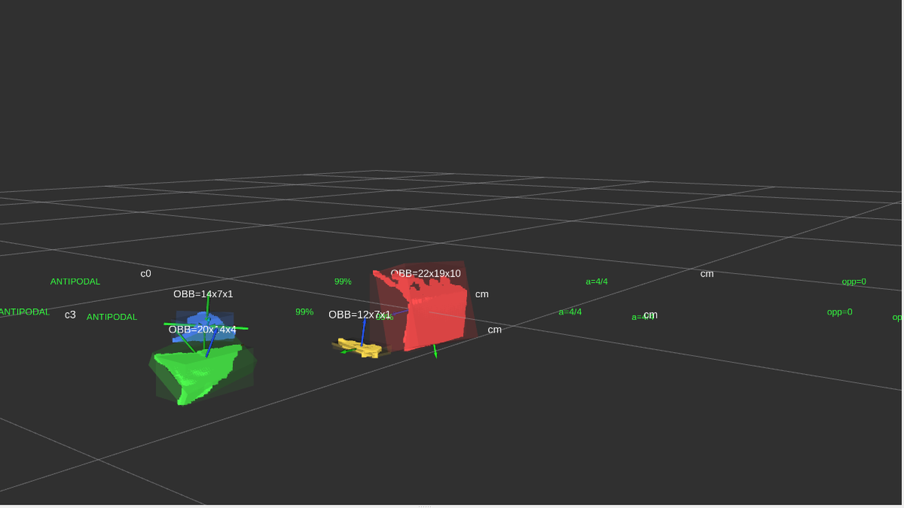
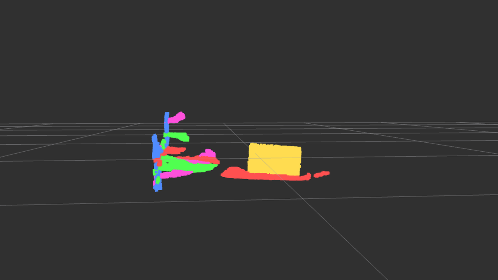
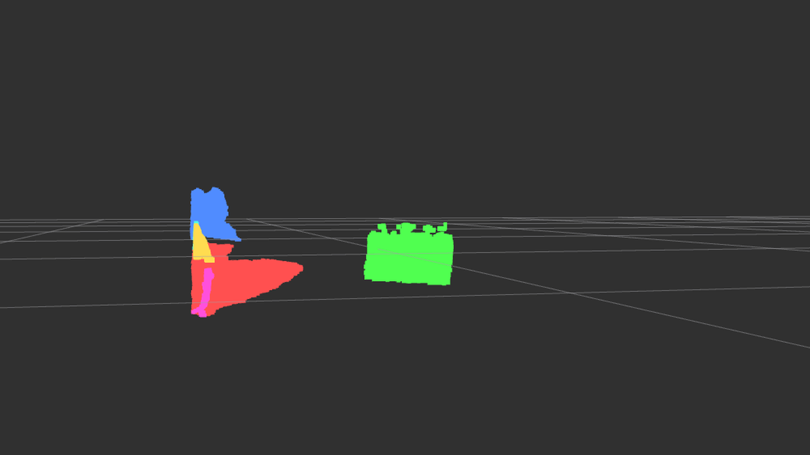
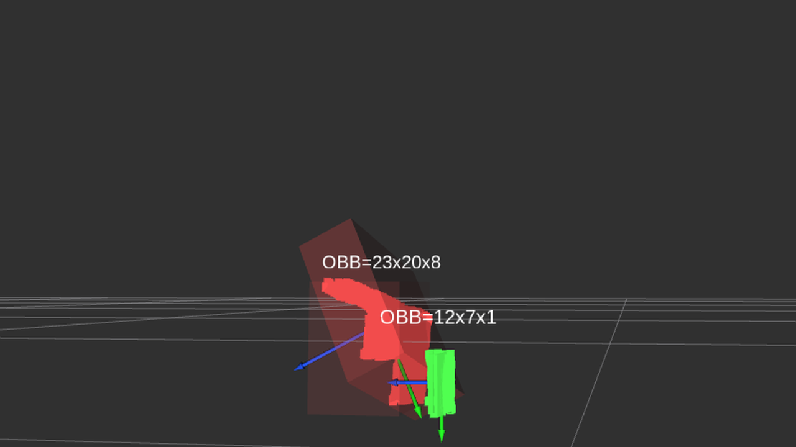
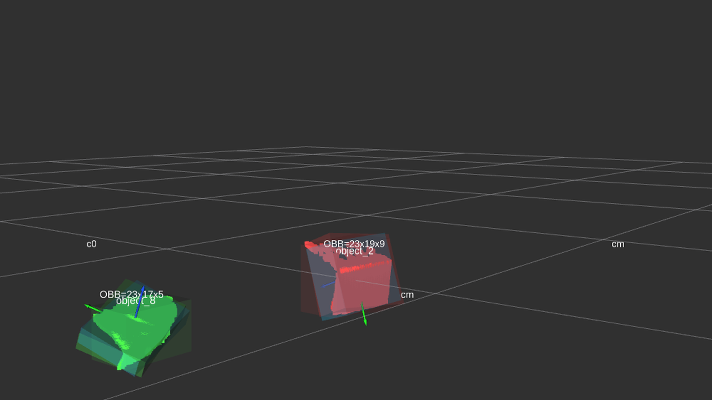

# RGB-D Parcel Perception and Grasping

Experimental ROS 2 perception pipeline for parcel detection, 3D geometry estimation, object tracking, and grasp-pose generation from RGB-D data.

The current system uses an Intel RealSense D435if and a geometry-first approach based on point-cloud processing, plane segmentation, Euclidean clustering, PCA/OBB estimation, temporal tracking, local surface normals, and antipodal grasp validation.

The goal is to build a modular perception stack suitable for robotic parcel picking while keeping each processing stage measurable and interpretable.

<p align="center">
  
</p>

## Current pipeline

```text
Intel RealSense D435if
        |
        v
RGB-D acquisition / PointCloud2
        |
        v
3D CropBox
        |
        v
VoxelGrid downsampling
        |
        v
Multi-plane RANSAC
        |
        v
Support-plane selection
        |
        v
Support-plane removal
        |
        v
Euclidean clustering
        |
        v
PCA + AABB + OBB
        |
        v
Temporal object tracking
        |
        v
Geometric grasp candidates
        |
        v
Gripper-width + table-clearance filtering
        |
        v
Local surface-normal estimation
        |
        v
Antipodal grasp validation
        |
        v
Contact-based grasp refinement
```

The pipeline currently outputs grasp poses in the camera optical frame. Robot-frame calibration, inverse kinematics, collision checking, and execution are intentionally kept outside this repository at the current stage.

---

## 1. Multi-plane segmentation

The incoming point cloud is first cropped to a working volume and downsampled with a voxel grid.

Multiple dominant planes are then extracted iteratively with RANSAC.

<p align="center">
  
</p>

For a plane

$$
ax + by + cz + d = 0
$$

RANSAC repeatedly samples points, estimates a plane hypothesis, and counts points whose orthogonal distance satisfies

$$
\frac{|ax_i+by_i+cz_i+d|}
{\sqrt{a^2+b^2+c^2}}
< \tau.
$$

This provides a robust geometric baseline in the presence of outliers and incomplete depth measurements.

---

## 2. Support-plane removal and object clustering

The support surface is selected interactively in RViz.

Once the table plane has been identified, its points are removed and Euclidean clustering is applied to the remaining cloud.

<p align="center">
  
</p>

Two points are considered spatially connected when their Euclidean distance is sufficiently small. A KD-tree is used for efficient neighborhood queries.

Current default clustering parameters:

```text
cluster tolerance : 20 mm
minimum size      : 100 points
maximum size      : 30000 points
```

This stage is purely geometric: it separates spatially disconnected objects but does not yet assign semantic parcel classes.

---

## 3. 3D geometry estimation with PCA and OBBs

For each cluster, the centroid and covariance matrix are computed:

$$
\mu = \frac{1}{N}\sum_{i=1}^{N} p_i
$$

$$
\Sigma =
\frac{1}{N}
\sum_{i=1}^{N}
(p_i-\mu)(p_i-\mu)^T.
$$

The eigenvectors of the covariance matrix provide the principal geometric directions of the cluster.

These directions are used to estimate an oriented bounding box (OBB).

<p align="center">
  
</p>

Unlike an axis-aligned bounding box, the OBB follows the orientation of the object and provides an initial estimate of its:

- 3D center,
- dimensions,
- principal axes,
- orientation.

The current implementation uses PCA-based OBBs rather than exact minimum-volume bounding boxes.

---

## 4. Temporal object tracking

Per-frame cluster IDs are not persistent: the largest cluster can become `cluster_0` in one frame and `cluster_1` in the next.

A temporal tracker therefore associates detections using position and object dimensions.

<p align="center">
  
</p>

A simplified association cost is based on

$$
C_{ij} =
\frac{\|c_i-c_j\|}{D_{\max}}
+
\lambda
\frac{E_{\mathrm{dimensions}}}{E_{\max}}.
$$

The tracker also stabilizes PCA/OBB orientation ambiguities.

Because PCA eigenvectors satisfy

$$
v \equiv -v,
$$

the same physical box can otherwise exhibit artificial 180-degree orientation flips.

Equivalent cuboid-axis representations are compared against the previous orientation before temporal smoothing is applied.

---

## 5. Geometric grasp candidate generation

For an OBB with center \(C\), local axes \(u_0,u_1,u_2\), and dimensions \(d_0,d_1,d_2\), the ideal opposite contacts for closing along axis \(u_i\) are

$$
p_i^+ = C+\frac{d_i}{2}u_i
$$

and

$$
p_i^- = C-\frac{d_i}{2}u_i.
$$

Three possible closing axes are considered.

For each closing direction, candidate approach directions are generated from the two remaining OBB axes and both signs.

This produces up to

$$
3 \times 2 \times 2 = 12
$$

raw geometric candidates per object.

---

## 6. Grasp feasibility filtering

Candidates are filtered using geometric constraints.

The required gripper opening is

```math
w_{\text{required}} = w_{\text{object}} + 2c
```

where $c$ is a safety clearance.

The current configuration uses an 80 mm maximum opening.

Candidates are also rejected when the pre-grasp or theoretical contact points are too close to the support plane.

This removes, for example:

- grasps wider than the gripper,
- approaches through the table,
- contacts too close to the support surface.

---

## 7. Local normals and antipodal grasp validation

An OBB only predicts where object faces should be. It does not guarantee that actual measured surfaces exist at those locations.

For each candidate contact, a local point-cloud neighborhood is extracted.

The local covariance is

$$
\Sigma =
\frac{1}{N}
\sum_i
(p_i-\mu)(p_i-\mu)^T.
$$

For a locally planar surface, the eigenvector corresponding to the smallest eigenvalue approximates the surface normal.

For a parallel-jaw grasp with closing direction \(c\), an ideal antipodal configuration satisfies

$$
n_0 \approx -c
$$

$$
n_1 \approx c
$$

and therefore

$$
n_0 \approx -n_1.
$$

<p align="center">
  
</p>

Candidates are classified as:

```text
ACCEPTED
    both contact regions are observed and their normals are compatible
    with an antipodal grasp

REJECTED
    both surfaces are observed but their geometry is incompatible

UNVERIFIED
    one or both contact regions are not sufficiently visible
    from the current RGB-D viewpoint
```

The `UNVERIFIED` state is important for single-camera perception: an occluded rear surface cannot be assumed to be geometrically invalid.

---

## 8. Contact-based grasp refinement

For accepted candidates, the theoretical OBB contacts are replaced by measured surface points \(q_0,q_1\).

The refined grasp center becomes

$$
g = \frac{q_0+q_1}{2}
$$

and the measured closing width becomes

$$
w = \|q_1-q_0\|.
$$

The refined closing axis is

$$
y_g =
\frac{q_1-q_0}
{\|q_1-q_0\|}.
$$

The approach direction is projected onto the plane perpendicular to \(y_g\), then the grasp frame is re-orthogonalized to obtain

$$
R_g =
\begin{bmatrix}
x_g & y_g & z_g
\end{bmatrix}.
$$

The resulting pose is published as a 6D grasp pose in the camera optical frame.

---

## ROS 2 nodes

The package currently contains:

```text
realsense_image_benchmark
realsense_depth_quality
realsense_pixel_to_3d

realsense_cloud_filter
realsense_voxel_filter

realsense_plane_ransac
realsense_multiplane_ransac
realsense_support_plane_selector

realsense_euclidean_cluster
realsense_temporal_obb_tracker

realsense_grasp_candidate_generator
realsense_grasp_candidate_filter
realsense_antipodal_grasp_validator
realsense_grasp_refinement_selector
```

---

## Main ROS topics

Examples of useful intermediate outputs:

```text
/r10/cloud_filtered
/r10/cloud_voxel

/r10/cloud_planes_colored
/r10/cloud_support_plane
/r10/cloud_without_support

/r10/cloud_clusters_colored
/r10/cluster_geometry_markers

/r10/tracked_object_markers

/r10/grasp_candidate_markers
/r10/grasp_filtered_markers
/r10/grasp_antipodal_markers
/r10/grasp_selected_markers

/r10/grasp_selected_poses
/r10/pregrasp_selected_poses
```

---

## Default parameters

Current experimental defaults include:

```text
3D crop volume
X : [-0.45, +0.45] m
Y : [-0.35, +0.35] m
Z : [ 0.15, +1.50] m

VoxelGrid
leaf size : 5 mm

RANSAC
distance threshold : 10 mm
iterations         : 800
minimum inliers    : 800

Euclidean clustering
distance tolerance : 20 mm
minimum cluster    : 100 points
maximum cluster    : 30000 points
```

These parameters are experimental and are intended to be benchmarked rather than considered universal.

---

## Tested environment

The current prototype has been tested with:

```text
Ubuntu 24.04 LTS
ROS 2 Jazzy
Intel RealSense D435if
C++17
PCL
librealsense / realsense2_camera
CycloneDDS
RViz2
```

The ROS package has also been rebuilt successfully from a clean ROS 2 workspace independently of the robot-control workspace.

---

## Build

Create a clean workspace:

```bash
mkdir -p ~/parcel_ws/src
cd ~/parcel_ws/src
```

Clone this repository and place the ROS package in the workspace:

```bash
git clone https://github.com/mlsn111/rgbd-parcel-grasping.git rgbd-parcel-grasping
cp -r rgbd-parcel-grasping/ros2_package ./realsense_benchmark
cd ..
```

Install dependencies:

```bash
source /opt/ros/jazzy/setup.bash

rosdep install \
  --from-paths src \
  --ignore-src \
  -r \
  -y
```

Build:

```bash
colcon build \
  --symlink-install \
  --packages-select realsense_benchmark
```

Then:

```bash
source install/setup.bash
```

---

## Launch

CycloneDDS is currently used on the tested machine:

```bash
export RMW_IMPLEMENTATION=rmw_cyclonedds_cpp

source /opt/ros/jazzy/setup.bash
source ~/parcel_ws/install/setup.bash

ros2 launch realsense_benchmark r10_perception.launch.py \
  use_rviz:=true \
  support_plane_id:=-1
```

In RViz:

1. select the camera optical frame as the fixed frame,
2. use `Publish Point`,
3. click directly on the support table.

The support-plane selector then locks onto the table and activates the downstream object-segmentation and grasp pipeline.

---

## Current limitations

This repository is an experimental geometry-first baseline.

Current limitations include:

- support-plane initialization is still interactive,
- Euclidean clustering is geometric and has no semantic understanding,
- nearby/touching parcels can merge into one cluster,
- PCA orientation becomes ambiguous for nearly symmetric objects,
- occluded surfaces cannot be validated from a single RGB-D viewpoint,
- deformable parcels and bags are not yet explicitly modeled,
- no learned parcel segmentation is currently included,
- output grasp poses are still expressed in the camera frame,
- camera-to-robot extrinsic calibration is not yet included,
- robot reachability, IK, and collision checking are not yet part of this repository,
- no physical grasp execution is performed by this pipeline.

---

## Planned work

The next development stages are:

```text
RGB instance segmentation
        |
        v
RGB mask + depth fusion
        |
        v
semantic parcel point cloud
        |
        v
geometry / 6D pose estimation
        |
        v
grasp generation and scoring
        |
        v
camera-to-robot calibration
        |
        v
TF transformation to robot base
        |
        v
MoveIt IK and reachability
        |
        v
collision checking
        |
        v
experimental robotic picking
```

The geometry-based pipeline will remain as a baseline for comparison with learned methods.

Future benchmarks will include:

- cartons,
- bags / deformable parcels,
- touching parcels,
- stacked parcels,
- partial occlusions,
- different object dimensions,
- different viewpoints,
- different camera distances,
- varying lighting conditions.

Metrics of interest include:

- depth validity and noise,
- 3D localization error,
- dimension error,
- orientation error,
- segmentation quality,
- grasp success rate,
- end-to-end latency,
- processing frequency.

---

## Motivation

The project is intended as a practical exploration of perception for robotic manipulation.

A geometry-first implementation provides an interpretable baseline before introducing learned components such as instance segmentation, 6D pose estimation, or learned grasp scoring.

This makes it possible to quantify where classical 3D geometry is sufficient and where learned perception becomes necessary.
